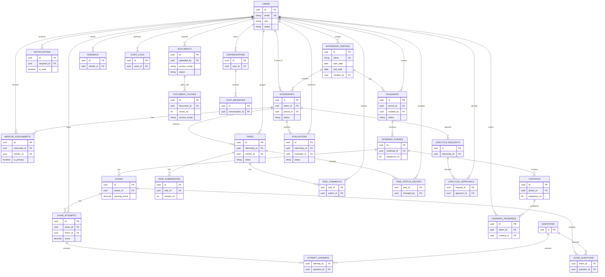

# TÀI LIỆU ĐẶC TẢ YÊU CẦU PHẦN MỀM

## HỆ THỐNG QUẢN LÝ THỰC TẬP SINH

(INTERNSHIP TRAINING MANAGEMENT SYSTEM - ITMS)

| **Thông tin** | **Nội dung**                                                            |
|---------------|-------------------------------------------------------------------------|
| Tên dự án     | Hệ thống Quản lý Thực tập sinh (ITMS)                                   |
| Mã tài liệu   | ITMS-SRS-2026                                                           |
| Phiên bản     | 1.0 - Bản rút gọn                                                       |
| Mục đích      | Làm cơ sở phân tích, thiết kế, lập trình và kiểm thử đồ án chuyên ngành |
| Phạm vi       | Quản lý thực tập, đào tạo, task, đánh giá, báo cáo và trợ lý AI/RAG     |

Năm thực hiện: 2026

# THÔNG TIN TÀI LIỆU

Tài liệu giữ đầy đủ các nhóm chức năng của ITMS, gồm quản lý thực tập, LMS, task, đánh giá, báo cáo và trợ lý AI/RAG. Mỗi yêu cầu được trình bày ngắn gọn để phù hợp phạm vi một đồ án chuyên ngành.

| **Phiên bản** | **Ngày**   | **Người thực hiện** | **Nội dung**                                       |
|---------------|------------|---------------------|----------------------------------------------------|
| 1.0           | 13/09/2026 | Nhóm thực hiện      | Giữ đủ chức năng của SRS gốc; rút gọn cách đặc tả. |

## Đối tượng sử dụng

- Nhóm phát triển: làm căn cứ thiết kế giao diện, API và cơ sở dữ liệu.

- Người dùng mô phỏng: Intern, Mentor và Quản trị viên.

## Quy ước

| **Ký hiệu** | **Ý nghĩa**             |
|-------------|-------------------------|
| FR          | Yêu cầu chức năng       |
| NFR         | Yêu cầu phi chức năng   |
| UC          | Use case / ca sử dụng   |
| RBAC        | Phân quyền theo vai trò |

# MỤC LỤC

| **Mục** | **Nội dung**                       |
|---------|------------------------------------|
| 1\.     | Giới thiệu                         |
| 2\.     | Tổng quan hệ thống                 |
| 3\.     | Phạm vi chức năng và người dùng    |
| 4\.     | Đặc tả yêu cầu chức năng           |
| 5\.     | Quy tắc nghiệp vụ                  |
| 6\.     | Yêu cầu dữ liệu                    |
| 7\.     | Giao diện và yêu cầu phi chức năng |
| 8\.     | Ràng buộc triển khai và kiểm thử   |
| 9\.     | Ma trận truy vết                   |

Cấu trúc được tinh gọn: giữ đủ chức năng nhưng chỉ mô tả mục tiêu, tác nhân, luồng chính và tiêu chí chấp nhận; không đi sâu vào thiết kế lớp, API hoặc cấu hình hạ tầng.

# 1. GIỚI THIỆU

## 1.1 Mục đích

ITMS hỗ trợ toàn bộ quá trình thực tập: tiếp nhận intern, phân mentor, đào tạo và kiểm tra, giao task, đánh giá, gia hạn/kết thúc, báo cáo và hỏi đáp bằng AI. Tài liệu xác định phạm vi phiên bản demo của đồ án.

## 1.2 Phạm vi

| **Trong phạm vi**                                                                                                          | **Ngoài phạm vi**                                                                                                 |
|----------------------------------------------------------------------------------------------------------------------------|-------------------------------------------------------------------------------------------------------------------|
| Tài khoản/RBAC; đợt thực tập; LMS và bài kiểm tra; task; đánh giá; gia hạn/kết thúc; thông báo; phản ánh; báo cáo; AI/RAG. | Chấm công thiết bị; payroll; hợp đồng lao động; video meeting; live coding; tích hợp trực tiếp Jira/GitHub/Slack. |

## 1.3 Thuật ngữ

| **Thuật ngữ** | **Diễn giải**                                                       |
|---------------|---------------------------------------------------------------------|
| Intern        | Thực tập sinh tham gia một đợt thực tập.                            |
| Mentor        | Người hướng dẫn, giao việc và đánh giá intern.                      |
| Manager/Admin | Người quản lý nghiệp vụ và cấu hình hệ thống.                       |
| LMS           | Phân hệ quản lý lộ trình, tài liệu, bài kiểm tra và tiến độ học.    |
| RAG           | Kỹ thuật AI tìm đoạn tài liệu liên quan trước khi sinh câu trả lời. |

# 2. TỔNG QUAN HỆ THỐNG

## 2.1 Bối cảnh và kiến trúc

Hệ thống được xây dựng theo mô hình web client - server. Người dùng thao tác bằng trình duyệt; backend xử lý nghiệp vụ, phân quyền và dữ liệu; PostgreSQL lưu dữ liệu chính. Kiến trúc này đơn giản, phù hợp triển khai nhóm nhỏ và có thể mở rộng sau này.

| **Thành phần**          | **Vai trò**                                                |
|-------------------------|------------------------------------------------------------|
| Web Client              | Giao diện theo vai trò Intern, Mentor và Manager/Admin.    |
| Backend API             | Xử lý nghiệp vụ, RBAC, báo cáo và kết nối AI.              |
| Database/Object Storage | Lưu dữ liệu nghiệp vụ, tài liệu và tệp bài nộp.            |
| AI/RAG Service          | Embedding, tìm kiếm tài liệu và sinh câu trả lời có nguồn. |

## 2.2 Môi trường vận hành

- Trình duyệt hiện đại: Chrome, Edge, Firefox hoặc Safari.

- Máy chủ hoặc môi trường Docker; cơ sở dữ liệu PostgreSQL/MySQL.

- Giao diện tiếng Việt, hiển thị tốt trên desktop và tablet.

## 2.3 Giả định

- Mỗi intern thuộc một đợt thực tập đang hoạt động và có một mentor chính.

- Manager/Admin chuẩn bị roadmap, bài kiểm tra, tiêu chí đánh giá và tài liệu cho RAG.

- Khi dịch vụ AI lỗi, các chức năng quản lý cốt lõi vẫn hoạt động bình thường.

# 3. PHẠM VI CHỨC NĂNG VÀ NGƯỜI DÙNG

## 3.1 Vai trò người dùng

| **Vai trò**   | **Quyền chính**                                                       | **Mức sử dụng** |
|---------------|-----------------------------------------------------------------------|-----------------|
| Intern        | Học theo roadmap, làm bài kiểm tra, nộp task, xem đánh giá, hỏi AI.   | Cơ bản          |
| Mentor        | Theo dõi intern, giao/review task, nhận xét, đánh giá, đề xuất xử lý và hỏi AI. | Khá |
| Manager/Admin | Quản lý tài khoản, đợt, LMS, phê duyệt, báo cáo, cấu hình và hỏi AI. | Khá             |

## 3.2 Các phân hệ cốt lõi

| **Mã** | **Phân hệ**             | **Mô tả ngắn**                                                 |
|--------|-------------------------|----------------------------------------------------------------|
| M01    | Tài khoản và phân quyền | Đăng nhập, hồ sơ cá nhân, kiểm tra quyền.                      |
| M02    | Quản lý thực tập        | Quản lý đợt thực tập, intern, mentor và phân công.             |
| M03    | Đào tạo và kiểm tra     | Roadmap, tài liệu, tiến độ, ngân hàng câu hỏi và bài kiểm tra. |
| M04    | Task và bài nộp         | Giao, nộp, review, yêu cầu làm lại, comment và lịch sử.        |
| M05    | Đánh giá và vòng đời    | Đánh giá định kỳ/cuối kỳ, gia hạn, dừng và kết thúc.           |
| M06    | Điều hành và tương tác  | Thông báo, phản ánh, dashboard, báo cáo và audit.              |
| M07    | Trợ lý AI/RAG           | Hỏi đáp tài liệu và tra cứu dữ liệu ITMS theo quyền.           |

## 3.3 Use case chính

Manager tạo đợt, roadmap và phân mentor; Intern học, làm bài kiểm tra và task; Mentor review, đánh giá hoặc đề xuất gia hạn/kết thúc; Manager phê duyệt và xem báo cáo. Người dùng có thể hỏi trợ lý AI trong phạm vi dữ liệu được phép.

# 4. ĐẶC TẢ YÊU CẦU CHỨC NĂNG

## 4.1 M01 - Tài khoản và phân quyền

| **Mã** | **Yêu cầu**       | **Mô tả ngắn**                                            |
|--------|-------------------|-----------------------------------------------------------|
| FR-01  | Xác thực          | Đăng nhập, đăng xuất, đổi/quên mật khẩu và quản lý phiên. |
| FR-02  | RBAC              | Phân quyền Intern, Mentor, Manager và Admin tại Backend.  |
| FR-03  | Hồ sơ             | Người dùng cập nhật các trường cá nhân được cho phép.     |
| FR-04  | Quản lý tài khoản | Admin tạo, sửa, khóa/mở khóa tài khoản và gán vai trò.    |

## 4.2 M02 - Quản lý thực tập

| **Mã** | **Yêu cầu**         | **Mô tả ngắn**                                        |
|--------|---------------------|-------------------------------------------------------|
| FR-05  | Đợt thực tập        | Tạo đợt, thời gian, trạng thái và danh sách tham gia. |
| FR-06  | Hồ sơ intern/mentor | Quản lý thông tin, kỹ năng và trạng thái hoạt động.   |
| FR-07  | Phân công mentor    | Gán/đổi mentor chính, lưu lịch sử phân công.          |
| FR-08  | Theo dõi tổng quan  | Mentor xem intern phụ trách; Manager xem toàn đợt.    |

## 4.3 M03 - Đào tạo và kiểm tra LMS

| **Mã** | **Yêu cầu**       | **Mô tả / tiêu chí chấp nhận**                                                    |
|--------|-------------------|-----------------------------------------------------------------------------------|
| FR-09  | Quản lý roadmap   | Manager tạo roadmap gồm các giai đoạn, thứ tự, thời gian và điều kiện hoàn thành. |
| FR-10  | Tài liệu đào tạo  | Tạo nội dung học, đính kèm tài liệu/link và gán cho roadmap hoặc đợt thực tập.    |
| FR-11  | Theo dõi tiến độ  | Intern xem nội dung được giao và trạng thái; Mentor theo dõi tỷ lệ hoàn thành.    |
| FR-12  | Ngân hàng câu hỏi | Manager tạo câu hỏi, đáp án, mức độ và nhóm chủ đề.                               |
| FR-13  | Tạo bài kiểm tra  | Cấu hình câu hỏi, thời lượng, số lượt làm, điểm đạt và thời gian mở.              |
| FR-14  | Làm/chấm bài      | Intern làm bài; hệ thống tự chấm câu hỗ trợ và lưu từng lượt làm.                 |
| FR-15  | Kết quả kiểm tra  | Intern xem kết quả theo cấu hình; Mentor/Manager xem thống kê.                    |

### Luồng chính

Manager tạo roadmap, nội dung và bài kiểm tra; Intern học và làm bài; hệ thống cập nhật tiến độ, chấm điểm và cung cấp kết quả cho người có quyền.

## 4.4 M04 - Task và bài nộp

| **Mã** | **Yêu cầu**   | **Mô tả / tiêu chí chấp nhận**                                       |
|--------|---------------|----------------------------------------------------------------------|
| FR-16  | Tạo/giao task | Mentor nhập mô tả, deadline, ưu tiên, tài liệu và intern nhận việc.  |
| FR-17  | Theo dõi task | Hiển thị trạng thái, deadline, overdue, comment và lịch sử thay đổi. |
| FR-18  | Nộp/nộp lại   | Intern gửi nội dung, tệp hoặc link; mỗi lần nộp tạo một phiên bản.   |
| FR-19  | Review        | Mentor chọn hoàn thành hoặc yêu cầu làm lại kèm nhận xét.            |
| FR-20  | Trao đổi      | Intern và Mentor bình luận trong task theo phạm vi quyền.            |

### Luồng chính

- Mentor giao task; Intern nhận thông báo và nộp kết quả.

- Task chuyển sang Chờ review; Mentor hoàn thành hoặc yêu cầu làm lại.

- Hệ thống giữ lịch sử submission, comment và trạng thái.

## 4.5 M05 - Đánh giá và vòng đời thực tập

| **Mã** | **Yêu cầu**              | **Mô tả / tiêu chí chấp nhận**                                           |
|--------|--------------------------|--------------------------------------------------------------------------|
| FR-21  | Bộ tiêu chí              | Manager cấu hình tiêu chí, thang điểm và trọng số.                       |
| FR-22  | Đánh giá định kỳ/cuối kỳ | Mentor chấm điểm, nhận xét, lưu nháp và công bố.                         |
| FR-23  | Xem đánh giá             | Intern chỉ xem đánh giá đã công bố; hệ thống lưu lịch sử.                |
| FR-24  | Yêu cầu gia hạn          | Intern gửi yêu cầu; Mentor có thể đề xuất gia hạn.                       |
| FR-25  | Dừng/kết thúc            | Mentor đề xuất; Manager phê duyệt hoặc từ chối kèm lý do.                |
| FR-26  | Cập nhật vòng đời        | Áp dụng trạng thái Planned, Active, Extended, Completed hoặc Terminated. |

### Luồng chính

Mentor đánh giá intern và có thể đề xuất gia hạn/kết thúc. Manager xem tiến độ, task và đánh giá liên quan trước khi quyết định; hệ thống lưu người xử lý, thời điểm và lý do.

## 4.6 M06 - Điều hành và tương tác

| **Mã** | **Yêu cầu**       | **Mô tả / tiêu chí chấp nhận**                                                    |
|--------|-------------------|-----------------------------------------------------------------------------------|
| FR-27  | Thông báo sự kiện | Tạo thông báo khi phân công, giao/nộp/review task, đánh giá và phê duyệt.         |
| FR-28  | Thông báo chung   | Manager/Admin gửi hoặc hẹn giờ thông báo cho nhóm người dùng.                     |
| FR-29  | Phản ánh/góp ý    | Intern gửi phản ánh; Manager phản hồi và cập nhật trạng thái xử lý.               |
| FR-30  | Dashboard         | Thống kê intern, tiến độ LMS, task, điểm kiểm tra, đánh giá và yêu cầu chờ duyệt. |
| FR-31  | Báo cáo           | Lọc theo đợt, mentor, intern, trạng thái và xuất Excel/PDF nếu triển khai.        |
| FR-32  | Audit/cấu hình    | Admin xem log thao tác quan trọng và cấu hình tham số cho phép.                   |

### Luồng chính

Sự kiện nghiệp vụ tạo thông báo đúng người nhận. Dashboard và báo cáo chỉ tổng hợp dữ liệu trong phạm vi quyền; các thao tác quản trị, phê duyệt và đổi quyền được ghi audit.

## 4.7 M07 - Trợ lý AI và RAG

### 4.7.1 Hỏi đáp tài liệu

| **Mã** | **Yêu cầu**           | **Mô tả / tiêu chí chấp nhận**                                                    |
|--------|-----------------------|-----------------------------------------------------------------------------------|
| FR-33  | Quản lý kho tài liệu  | Admin tải PDF/DOCX/PPTX, gắn phạm vi truy cập và kích hoạt phiên bản tài liệu.    |
| FR-34  | Ingest và lập chỉ mục | Hệ thống parse, chunk, bổ sung context, embedding và lưu vector để tìm kiếm.      |
| FR-35  | Hỏi đáp RAG           | Intern, Mentor và Manager/Admin hỏi AI; hệ thống tìm đoạn liên quan, sinh câu trả lời có nguồn và từ chối khi không đủ căn cứ. |
| FR-36  | Tra cứu dữ liệu ITMS  | AI gọi API nội bộ để trả lời về task, deadline, tiến độ hoặc thống kê theo quyền. |
| FR-37  | Lịch sử hội thoại     | Lưu câu hỏi/câu trả lời theo chính sách và cho phép bắt đầu cuộc trò chuyện mới.  |

### Luồng RAG

Câu hỏi → kiểm tra vai trò/phạm vi → embedding truy vấn → tìm đoạn liên quan → LLM sinh câu trả lời → kiểm tra citation → trả câu trả lời có nguồn hoặc thông báo không đủ dữ liệu.

### Giới hạn an toàn

- AI không được bỏ qua RBAC hoặc sử dụng tài liệu ngoài quyền.

- AI không tự phê duyệt gia hạn, hoàn thành task hay công bố đánh giá.

- Khi AI tạm lỗi, các phân hệ quản lý khác vẫn hoạt động.

# 5. QUY TẮC NGHIỆP VỤ

| **Mã** | **Quy tắc**                                                                              |
|--------|------------------------------------------------------------------------------------------|
| BR-01  | Một Intern chỉ có một Mentor chính tại cùng một thời điểm trong một đợt thực tập.        |
| BR-02  | Chỉ Mentor phụ trách mới được tạo, sửa, review task và đánh giá của Intern đó.           |
| BR-03  | Intern không được tự chuyển task sang Hoàn thành; chỉ Mentor xác nhận hoàn thành.        |
| BR-04  | Task có các trạng thái: Mới giao, Chờ review, Yêu cầu làm lại, Hoàn thành, Đã hủy.       |
| BR-05  | Task quá deadline vẫn có thể nộp nếu Mentor cho phép, nhưng phải được đánh dấu nộp muộn. |
| BR-06  | Đánh giá nháp chỉ Mentor/Admin xem; đánh giá đã công bố mới hiển thị cho Intern.         |
| BR-07  | Tài khoản bị khóa không thể đăng nhập hoặc tạo thao tác mới.                             |
| BR-08  | Dữ liệu danh sách và dashboard phải được lọc theo quyền người dùng.                      |
| BR-09  | Mỗi lượt làm bài kiểm tra phải tuân thủ thời gian mở, thời lượng và số lượt cấu hình.    |
| BR-10  | Không tồn tại đồng thời nhiều yêu cầu gia hạn đang chờ cho cùng một quá trình thực tập.  |
| BR-11  | AI chỉ được truy xuất tài liệu và dữ liệu nghiệp vụ trong phạm vi quyền của người hỏi.   |
| BR-12  | Câu trả lời RAG phải kèm nguồn; thiếu bằng chứng thì không suy đoán.                     |

Các quy tắc trên cần được kiểm tra cả ở giao diện và backend. Việc ẩn nút trên giao diện không thay thế việc kiểm tra quyền tại API.

# 6. YÊU CẦU DỮ LIỆU

## 6.1 Quan hệ dữ liệu mức logic

User có vai trò Intern, Mentor, Manager hoặc Admin. Một Intern tham gia một đợt qua `Internships`; mentor được gán và lưu lịch sử qua `MentorAssignments`. Roadmap thuộc một đợt, gồm phase, nội dung, tiến độ, ngân hàng câu hỏi và bài kiểm tra. Task, bài nộp, bình luận, vòng đời, phản ánh và audit đều truy vết được về người dùng/quá trình thực tập. Tài liệu AI được tách thành chunk để lập chỉ mục vector; hội thoại được lưu theo người dùng và quyền truy cập được kiểm tra trước khi AI trả lời.

Quy ước: `id` là UUID khóa chính (PK); trường hậu tố `_id` là khóa ngoại (FK); thời gian dùng `timestamp`; các trường `status`, `role`, `priority` dùng enum hoặc bảng danh mục tương đương. Toàn bộ FK phải được kiểm tra tại backend.

## 6.2 Các thực thể chính

| **Thực thể** | **Trường chính** | **Mục đích** |
|---|---|---|
| Users | id, email, password_hash, role, status | Tài khoản và phân quyền. |
| InternshipPeriods | id, name, start_date, end_date, status | Đợt thực tập. |
| Internships | id, intern_id, period_id, status | Quá trình thực tập của intern. |
| MentorAssignments | id, internship_id, mentor_id, assigned_at | Lịch sử phân công mentor. |
| Roadmaps | id, period_id, title, status | Lộ trình đào tạo theo đợt. |
| RoadmapPhases | id, roadmap_id, sequence_no | Các giai đoạn trong lộ trình. |
| Contents | id, phase_id, content_type, sequence_no | Nội dung/tài liệu đào tạo. |
| Exams | id, phase_id, duration_minutes, passing_score | Bài kiểm tra. |
| ExamAttempts | id, exam_id, intern_id, score | Lượt làm bài. |
| Tasks | id, internship_id, mentor_id, deadline, status | Task được giao. |
| TaskSubmissions | id, task_id, version_no, submitted_at | Các phiên bản bài nộp. |
| Evaluations | id, internship_id, evaluator_id, score, status | Đánh giá intern. |
| Notifications | id, recipient_id, type, is_read | Thông báo trong hệ thống. |
| Documents | id, uploaded_by, access_scope, status | Tài liệu nguồn cho RAG. |
| DocumentChunks | id, document_id, chunk_no, vector | Chỉ mục đoạn văn cho RAG. |
| LearningProgress | id, intern_id, content_id, status | Tiến độ học của intern. |
| Questions/ExamQuestions | id, exam_id, question_id, order | Ngân hàng câu hỏi và cấu hình đề thi. |
| AttemptAnswers | id, attempt_id, question_id, answer | Câu trả lời trong một lượt làm bài. |
| TaskComments/TaskStatusHistory | id, task_id, author_id, status | Trao đổi và lịch sử đổi trạng thái task. |
| LifecycleRequests/LifecycleApprovals | id, internship_id, request_type, status | Gia hạn/dừng/kết thúc và phê duyệt. |
| Feedback | id, sender_id, status, response | Phản ánh/góp ý của intern. |
| AuditLogs | id, actor_id, action, created_at | Nhật ký thao tác quan trọng. |
| Conversations/ChatMessages | id, user_id, conversation_id, content | Lịch sử hội thoại AI. |

### Chi tiết trường dữ liệu

#### Users — tài khoản và phân quyền

| Trường | Kiểu/ràng buộc | Mô tả |
|---|---|---|
| `id` | UUID, PK | Định danh duy nhất của người dùng. |
| `email` | varchar, unique, not null | Email đăng nhập; so sánh không phân biệt hoa/thường. |
| `password_hash` | varchar, not null | Mật khẩu đã băm; không lưu mật khẩu gốc. |
| `full_name` | varchar, not null | Họ tên hiển thị. |
| `role` | enum, not null | `INTERN`, `MENTOR`, `MANAGER` hoặc `ADMIN`; dùng cho RBAC. |
| `status` | enum, not null | `ACTIVE`, `INACTIVE` hoặc `LOCKED`; tài khoản khóa không được đăng nhập. |
| `created_at`, `updated_at` | timestamp, not null | Thời điểm tạo và cập nhật gần nhất. |

#### InternshipPeriods — đợt thực tập

| Trường | Kiểu/ràng buộc | Mô tả |
|---|---|---|
| `id` | UUID, PK | Định danh đợt thực tập. |
| `name` | varchar, unique, not null | Tên đợt, ví dụ `Internship 2026-Q1`. |
| `start_date`, `end_date` | date, not null | Khoảng thời gian dự kiến; ngày kết thúc không trước ngày bắt đầu. |
| `status` | enum, not null | `PLANNED`, `ACTIVE`, `CLOSED` hoặc `CANCELLED`. |
| `created_by` | UUID, FK → Users.id | Manager/Admin tạo đợt. |
| `created_at` | timestamp, not null | Thời điểm tạo đợt. |

#### Internships — quá trình thực tập

| Trường | Kiểu/ràng buộc | Mô tả |
|---|---|---|
| `id` | UUID, PK | Định danh một quá trình thực tập. |
| `intern_id` | UUID, FK → Users.id, not null | Người dùng có role `INTERN`. |
| `period_id` | UUID, FK → InternshipPeriods.id, not null | Đợt mà intern tham gia. |
| `status` | enum, not null | `PLANNED`, `ACTIVE`, `EXTENDED`, `COMPLETED` hoặc `TERMINATED`. |
| `start_date`, `end_date` | date, not null | Thời gian thực tế; có thể thay đổi khi gia hạn. |
| `note` | text, nullable | Ghi chú nghiệp vụ được phép. |
| `created_at`, `updated_at` | timestamp, not null | Thời điểm tạo và cập nhật. |

Ràng buộc: một `intern_id` chỉ có một `Internships` ở trạng thái `ACTIVE` trên toàn hệ thống.

#### MentorAssignments — lịch sử phân công mentor

| Trường | Kiểu/ràng buộc | Mô tả |
|---|---|---|
| `id` | UUID, PK | Định danh lần phân công. |
| `internship_id` | UUID, FK → Internships.id, not null | Quá trình thực tập được hướng dẫn. |
| `mentor_id` | UUID, FK → Users.id, not null | Người dùng có role `MENTOR`. |
| `assigned_at` | timestamp, not null | Thời điểm bắt đầu phân công. |
| `ended_at` | timestamp, nullable | Thời điểm kết thúc; `null` nghĩa là còn hiệu lực. |
| `is_primary` | boolean, not null | Đánh dấu mentor chính. |
| `assigned_by` | UUID, FK → Users.id | Manager/Admin thực hiện phân công. |

Ràng buộc: mỗi `Internships` chỉ có một mentor chính đang hiệu lực (`is_primary = true` và `ended_at is null`).

#### Roadmaps và RoadmapPhases — lộ trình đào tạo

**Roadmaps**

| Trường | Kiểu/ràng buộc | Mô tả |
|---|---|---|
| `id` | UUID, PK | Định danh roadmap. |
| `period_id` | UUID, FK → InternshipPeriods.id, not null | Đợt áp dụng roadmap. |
| `title` | varchar, not null | Tên lộ trình. |
| `description` | text, nullable | Mục tiêu hoặc phạm vi lộ trình. |
| `status` | enum, not null | `DRAFT`, `PUBLISHED` hoặc `ARCHIVED`. |
| `created_by` | UUID, FK → Users.id | Manager/Admin tạo roadmap. |

**RoadmapPhases**

| Trường | Kiểu/ràng buộc | Mô tả |
|---|---|---|
| `id` | UUID, PK | Định danh giai đoạn. |
| `roadmap_id` | UUID, FK → Roadmaps.id, not null | Roadmap chứa giai đoạn. |
| `title` | varchar, not null | Tên giai đoạn. |
| `sequence_no` | integer, not null | Thứ tự thực hiện, duy nhất trong một roadmap. |
| `duration_days` | integer, nullable | Số ngày dự kiến; phải lớn hơn 0 nếu có. |
| `completion_rule` | text, nullable | Điều kiện hoàn thành giai đoạn. |

#### Contents — nội dung đào tạo

| Trường | Kiểu/ràng buộc | Mô tả |
|---|---|---|
| `id` | UUID, PK | Định danh nội dung. |
| `phase_id` | UUID, FK → RoadmapPhases.id, not null | Giai đoạn chứa nội dung. |
| `title` | varchar, not null | Tên bài học/tài liệu. |
| `content_type` | enum, not null | `TEXT`, `LINK`, `FILE` hoặc `VIDEO`. |
| `content_body` | text, nullable | Nội dung văn bản; bắt buộc khi loại là `TEXT`. |
| `resource_url` | varchar, nullable | Link/tệp đính kèm khi nội dung cần tài nguyên. |
| `sequence_no` | integer, not null | Thứ tự nội dung trong giai đoạn. |
| `is_required` | boolean, not null | Nội dung có bắt buộc hoàn thành hay không. |

#### Exams và ExamAttempts — bài kiểm tra và lượt làm

**Exams**

| Trường | Kiểu/ràng buộc | Mô tả |
|---|---|---|
| `id` | UUID, PK | Định danh bài kiểm tra. |
| `phase_id` | UUID, FK → RoadmapPhases.id, not null | Giai đoạn có bài kiểm tra. |
| `title` | varchar, not null | Tên bài kiểm tra. |
| `duration_minutes` | integer, not null | Thời lượng làm bài, lớn hơn 0. |
| `max_attempts` | integer, not null | Số lượt được làm, lớn hơn 0. |
| `passing_score` | decimal(5,2), not null | Điểm đạt, trong khoảng 0–100. |
| `open_at`, `close_at` | timestamp, not null | Thời gian mở/đóng; `close_at` phải sau `open_at`. |

**ExamAttempts**

| Trường | Kiểu/ràng buộc | Mô tả |
|---|---|---|
| `id` | UUID, PK | Định danh lượt làm. |
| `exam_id` | UUID, FK → Exams.id, not null | Bài kiểm tra được làm. |
| `intern_id` | UUID, FK → Users.id, not null | Intern thực hiện lượt làm. |
| `attempt_no` | integer, not null | Số thứ tự lượt làm, duy nhất theo `exam_id`, `intern_id`. |
| `score` | decimal(5,2), nullable | Điểm sau khi chấm; `null` khi chưa có kết quả. |
| `started_at`, `submitted_at` | timestamp | Thời điểm bắt đầu và nộp bài. |
| `status` | enum, not null | `IN_PROGRESS`, `SUBMITTED`, `GRADED` hoặc `EXPIRED`. |

#### Tasks và TaskSubmissions — giao việc và bài nộp

**Tasks**

| Trường | Kiểu/ràng buộc | Mô tả |
|---|---|---|
| `id` | UUID, PK | Định danh task. |
| `internship_id` | UUID, FK → Internships.id, not null | Quá trình thực tập nhận task. |
| `mentor_id` | UUID, FK → Users.id, not null | Mentor giao và review task. |
| `title` | varchar, not null | Tiêu đề task. |
| `description` | text, not null | Yêu cầu chi tiết và tiêu chí thực hiện. |
| `priority` | enum, not null | `LOW`, `MEDIUM`, `HIGH` hoặc `URGENT`. |
| `deadline` | timestamp, not null | Hạn hoàn thành. |
| `status` | enum, not null | `ASSIGNED`, `PENDING_REVIEW`, `REVISION_REQUIRED`, `COMPLETED` hoặc `CANCELLED`. |
| `created_at`, `updated_at` | timestamp, not null | Thời điểm tạo và cập nhật. |

**TaskSubmissions**

| Trường | Kiểu/ràng buộc | Mô tả |
|---|---|---|
| `id` | UUID, PK | Định danh một phiên bản nộp bài. |
| `task_id` | UUID, FK → Tasks.id, not null | Task được nộp. |
| `content` | text, nullable | Nội dung nộp trực tiếp. |
| `link` | varchar, nullable | Link sản phẩm hoặc tài nguyên nộp. |
| `attachment_url` | varchar, nullable | Tệp đính kèm nếu có. |
| `version_no` | integer, not null | Phiên bản nộp, duy nhất trong một task. |
| `submitted_at` | timestamp, not null | Thời điểm nộp. |
| `reviewed_at` | timestamp, nullable | Thời điểm mentor review. |
| `review_comment` | text, nullable | Nhận xét của mentor. |

Ràng buộc: mỗi bài nộp cần có ít nhất một trong `content`, `link` hoặc `attachment_url`.

#### Evaluations — đánh giá thực tập

| Trường | Kiểu/ràng buộc | Mô tả |
|---|---|---|
| `id` | UUID, PK | Định danh bản đánh giá. |
| `internship_id` | UUID, FK → Internships.id, not null | Quá trình thực tập được đánh giá. |
| `evaluator_id` | UUID, FK → Users.id, not null | Mentor/Manager thực hiện đánh giá. |
| `evaluation_type` | enum, not null | `PERIODIC` hoặc `FINAL`. |
| `score` | decimal(5,2), not null | Điểm tổng hợp, trong khoảng 0–100. |
| `comment` | text, nullable | Nhận xét chi tiết. |
| `status` | enum, not null | `DRAFT` hoặc `PUBLISHED`; intern chỉ thấy bản đã công bố. |
| `published_at` | timestamp, nullable | Bắt buộc khi `status = PUBLISHED`. |

#### Notifications — thông báo

| Trường | Kiểu/ràng buộc | Mô tả |
|---|---|---|
| `id` | UUID, PK | Định danh thông báo. |
| `recipient_id` | UUID, FK → Users.id, not null | Người nhận. |
| `type` | enum, not null | Loại sự kiện, ví dụ `TASK_ASSIGNED`, `TASK_REVIEWED`, `EVALUATION_PUBLISHED`. |
| `title` | varchar, not null | Tiêu đề hiển thị. |
| `content` | text, not null | Nội dung thông báo. |
| `reference_type`, `reference_id` | varchar, UUID, nullable | Đối tượng nghiệp vụ liên quan để điều hướng. |
| `is_read` | boolean, not null | Trạng thái đã đọc. |
| `read_at`, `created_at` | timestamp | Thời điểm đọc và tạo thông báo. |

#### Documents và DocumentChunks — kho tri thức RAG

**Documents**

| Trường | Kiểu/ràng buộc | Mô tả |
|---|---|---|
| `id` | UUID, PK | Định danh tài liệu gốc. |
| `uploaded_by` | UUID, FK → Users.id, not null | Admin tải tài liệu lên. |
| `title` | varchar, not null | Tên hiển thị của tài liệu. |
| `source_url` | varchar, not null | Vị trí tệp trong object storage hoặc URL nguồn. |
| `file_type` | varchar, not null | Loại tệp được phép, như `PDF`, `DOCX`, `PPTX`. |
| `access_scope` | enum/JSON, not null | Vai trò hoặc phạm vi nghiệp vụ được phép truy cập. |
| `version` | integer, not null | Phiên bản tài liệu đang quản lý. |
| `status` | enum, not null | `PENDING`, `INDEXED`, `FAILED` hoặc `ARCHIVED`. |
| `created_at`, `activated_at` | timestamp | Thời điểm tải lên và kích hoạt phiên bản. |

**DocumentChunks**

| Trường | Kiểu/ràng buộc | Mô tả |
|---|---|---|
| `id` | UUID, PK | Định danh đoạn văn bản đã tách. |
| `document_id` | UUID, FK → Documents.id, not null | Tài liệu nguồn. |
| `chunk_no` | integer, not null | Thứ tự đoạn, duy nhất trong một tài liệu. |
| `text` | text, not null | Nội dung đoạn dùng để tìm kiếm và trích dẫn. |
| `vector` | vector, nullable | Embedding sau khi lập chỉ mục; không trả trực tiếp cho người dùng. |
| `metadata` | JSON, nullable | Số trang, tiêu đề mục hoặc thông tin hỗ trợ citation. |
| `access_scope` | enum/JSON, not null | Phạm vi truy cập kế thừa hoặc thu hẹp từ tài liệu. |

#### Thực thể hỗ trợ cho các yêu cầu chức năng

| Thực thể | Trường cốt lõi | Mục đích/ràng buộc |
|---|---|---|
| LearningProgress | id, intern_id FK, content_id FK, status, completed_at | Theo dõi FR-11; duy nhất theo `intern_id`, `content_id`. |
| Questions | id, content, question_type, difficulty, correct_answer | Ngân hàng câu hỏi cho FR-12. |
| ExamQuestions | exam_id FK, question_id FK, order_no, points | Ghép câu hỏi vào đề; duy nhất theo `exam_id`, `question_id`. |
| AttemptAnswers | attempt_id FK, question_id FK, answer, is_correct, score | Lưu đáp án và kết quả từng câu của FR-14. |
| TaskComments | id, task_id FK, author_id FK, content, created_at | Bình luận trong task cho FR-20. |
| TaskStatusHistory | id, task_id FK, old_status, new_status, changed_by FK | Lịch sử trạng thái task cho FR-17. |
| LifecycleRequests | id, internship_id FK, request_type, reason, status | Yêu cầu `EXTEND`, `TERMINATE` hoặc `COMPLETE` của FR-24/25. |
| LifecycleApprovals | id, request_id FK, approver_id FK, decision, decided_at | Lịch sử phê duyệt/từ chối kèm lý do. |
| Feedback | id, sender_id FK, content, status, response | Phản ánh và phản hồi cho FR-29. |
| AuditLogs | id, actor_id FK, action, entity_type, entity_id, created_at | Audit cho FR-32; lưu trước/sau ở metadata nếu cần. |
| Conversations | id, user_id FK, title, created_at | Một cuộc hội thoại AI của người dùng. |
| ChatMessages | id, conversation_id FK, sender_type, content, citations, created_at | Tin nhắn và citation cho FR-35/37. |

## 6.3 Quan hệ giữa các thực thể

| Quan hệ | Cardinality | Ý nghĩa và ràng buộc |
|---|---|---|
| Users → Internships | 1 — N | Một intern có thể tham gia nhiều đợt theo thời gian; mỗi quá trình thuộc đúng một intern. |
| InternshipPeriods → Internships | 1 — N | Một đợt có nhiều intern; mỗi quá trình thuộc đúng một đợt. |
| Internships → MentorAssignments | 1 — N | Lưu lịch sử đổi mentor; chỉ một mentor chính còn hiệu lực. |
| Users (Mentor) → MentorAssignments | 1 — N | Một mentor có thể hướng dẫn nhiều intern. |
| InternshipPeriods → Roadmaps | 1 — N | Một đợt có thể có nhiều roadmap; chỉ roadmap đã công bố mới được áp dụng. |
| Roadmaps → RoadmapPhases → Contents | 1 — N — N | Một roadmap gồm nhiều phase; mỗi phase có nhiều nội dung theo thứ tự. |
| RoadmapPhases → Exams → ExamAttempts | 1 — N — N | Một phase có nhiều bài kiểm tra; mỗi bài có nhiều lượt làm của intern. |
| Internships → Tasks → TaskSubmissions | 1 — N — N | Một quá trình có nhiều task; mỗi task giữ toàn bộ phiên bản bài nộp. |
| Users (Mentor) → Tasks | 1 — N | Mentor giao/review các task thuộc intern mình phụ trách. |
| Internships → Evaluations; Users → Evaluations | 1 — N; 1 — N | Một intern có nhiều kỳ đánh giá; mỗi bản do một mentor/manager lập. |
| Users → Notifications | 1 — N | Một người dùng nhận nhiều thông báo. |
| Users (Admin) → Documents → DocumentChunks | 1 — N — N | Admin tải tài liệu; một tài liệu tách thành nhiều chunk để RAG truy xuất. |
| Users + Contents → LearningProgress | N — N | Lưu trạng thái hoàn thành nội dung của từng intern. |
| Exams + Questions → ExamQuestions; ExamAttempts → AttemptAnswers | N — N; 1 — N | Đề thi có nhiều câu hỏi; mỗi lượt làm lưu đáp án từng câu. |
| Tasks → TaskComments/TaskStatusHistory | 1 — N | Lưu trao đổi, người thực hiện và mọi lần thay đổi trạng thái. |
| Internships → LifecycleRequests → LifecycleApprovals | 1 — N — N | Mỗi yêu cầu có lịch sử quyết định của người phê duyệt. |
| Users → Feedback/AuditLogs | 1 — N | Truy vết người gửi phản ánh và người thực hiện thao tác audit. |
| Users → Conversations → ChatMessages | 1 — N — N | Lưu lịch sử hỏi đáp AI theo người dùng. |

## 6.4 ERD logic

# 7. GIAO DIỆN VÀ YÊU CẦU PHI CHỨC NĂNG

## 7.1 Giao diện chính

| **Màn hình**      | **Nội dung chính**                                              |
|-------------------|-----------------------------------------------------------------|
| Dashboard         | Tiến độ đào tạo, task, đánh giá, thông báo và KPI theo vai trò. |
| LMS/Exam          | Roadmap, tài liệu, bài kiểm tra, lượt làm và kết quả.           |
| Task              | Danh sách, tạo, nộp, review, comment và lịch sử.                |
| Đánh giá/Vòng đời | Chấm điểm, gia hạn, dừng/kết thúc và phê duyệt.                 |
| Quản trị/Báo cáo  | Tài khoản, đợt, phân công, dashboard, báo cáo và audit.         |
| Trợ lý AI         | Chat, nguồn trích dẫn, lịch sử và trạng thái không đủ dữ liệu.  |

## 7.2 NFR

| **Mã** | **Yêu cầu**                                                                              |
|--------|------------------------------------------------------------------------------------------|
| NFR-01 | Giao diện responsive; ưu tiên desktop cho Mentor/Manager.                                |
| NFR-02 | API thường phản hồi khoảng 2 giây ở dữ liệu demo; AI có loading và timeout riêng.        |
| NFR-03 | Mật khẩu được băm; HTTPS khi triển khai; Backend kiểm tra RBAC.                          |
| NFR-04 | Kiểm tra đầu vào, MIME, loại/kích thước tệp và tránh lộ secret.                          |
| NFR-05 | Core ITMS tiếp tục hoạt động khi email hoặc AI tạm thời không khả dụng.                  |
| NFR-06 | RAG có citation, từ chối khi thiếu bằng chứng và không tự thực hiện quyết định nhạy cảm. |
| NFR-07 | Mã nguồn có README, migration, cấu hình mẫu và kiểm thử các workflow chính.              |

# 8. RÀNG BUỘC TRIỂN KHAI VÀ KIỂM THỬ

## 8.1 Ràng buộc triển khai

- Ứng dụng web client - server; REST/JSON qua HTTPS khi triển khai.

- Backend thực thi quyền và quy tắc nghiệp vụ; AI gọi dữ liệu qua cùng lớp kiểm soát quyền.

- Cơ sở dữ liệu lưu nghiệp vụ; object storage lưu tệp; vector store/pgvector lưu chỉ mục RAG.

- Có thể triển khai phiên bản demo theo module, nhưng giao diện phải thể hiện đầy đủ phạm vi đã đặc tả.

## 8.2 Phạm vi kiểm thử tối thiểu

| **Nhóm kiểm thử** | **Ví dụ**                                                            |
|-------------------|----------------------------------------------------------------------|
| RBAC              | Intern không xem intern khác; Mentor không thao tác ngoài phân công. |
| LMS/Exam          | Roadmap, giới hạn lượt/thời gian, chấm và công bố kết quả.           |
| Task/Đánh giá     | Nộp lại, quá hạn, review, nháp/công bố và lịch sử.                   |
| Vòng đời          | Gia hạn, dừng/kết thúc, xử lý lặp và lưu lý do.                      |
| AI/RAG            | Đúng phạm vi tài liệu, citation hợp lệ, thiếu nguồn, provider lỗi.   |
| Dữ liệu/Giao diện | Validation, upload, responsive, thông báo lỗi và xác nhận thao tác.  |

## 8.3 Tiêu chí nghiệm thu

- Các yêu cầu FR-01 đến FR-37 được triển khai hoặc thể hiện rõ mức ưu tiên trong kế hoạch đồ án.

- Trình diễn xuyên suốt luồng phân công - học/thi - task - đánh giá - phê duyệt - báo cáo.

- AI trả lời từ tài liệu có nguồn và không truy xuất dữ liệu ngoài quyền.

- Nhóm cung cấp source code, README, dữ liệu và tài khoản demo cho các vai trò.

# 9. MA TRẬN TRUY VẾT

| **Use case**    | **Yêu cầu liên quan** | **Kiểm thử**                            |
|-----------------|-----------------------|-----------------------------------------|
| UC-01 Tài khoản | FR-01 đến FR-04       | Xác thực, role, truy cập trái quyền.    |
| UC-02 Thực tập  | FR-05 đến FR-08       | Đợt, hồ sơ, phân công và phạm vi.       |
| UC-03 LMS       | FR-09 đến FR-15       | Roadmap, thi, giới hạn và kết quả.      |
| UC-04 Task      | FR-16 đến FR-20       | Giao, nộp, review, rework, lịch sử.     |
| UC-05 Đánh giá  | FR-21 đến FR-26       | Đánh giá, gia hạn và kết thúc.          |
| UC-06 Điều hành | FR-27 đến FR-32       | Thông báo, phản ánh, báo cáo, audit.    |
| UC-07 AI/RAG    | FR-33 đến FR-37       | Scope, retrieval, citation và fallback. |
